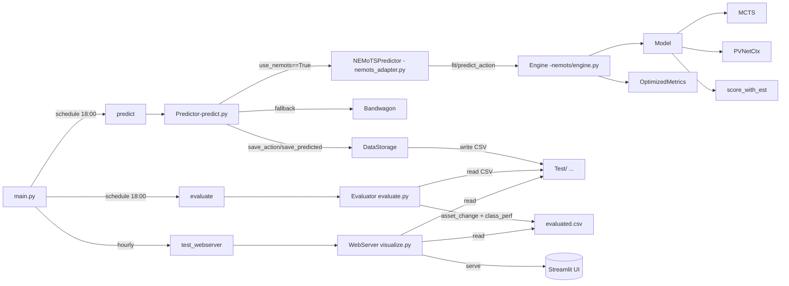
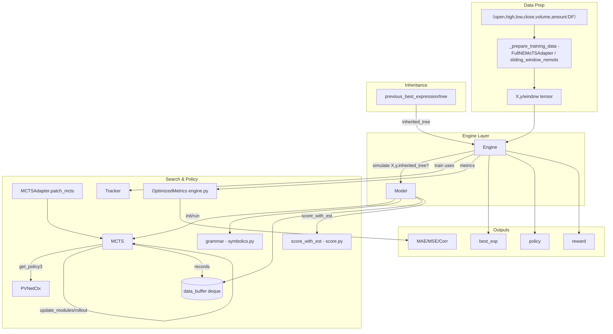

# Explainable Algorithmic Trading Agent via Symbolic Regression

This paper presents `EATA`, by using symbolic regression to conformally predict the future price distribution, thus creating the trading signals.

## Architecture

下面基于项目实际代码关系给出两张 Mermaid 架构图：模块依赖图与训练/预测时序图。你可以将代码块粘贴到 Mermaid 预览器或支持 Mermaid 的 Markdown 工具中渲染。

## 模块依赖关系图

关键关系引用：

- [NEMoTSAdapter](cci:2://file:///Users/yin/Desktop/doing/eata/nemots_adapter.py:666:0-706:9) 统一入口，内部的 [NEMoTSPredictor](cci:2://file:///Users/yin/Desktop/doing/eata/nemots_adapter.py:461:0-664:39) 根据数据量选择：
  - 充足数据：[FullNEMoTSAdapter](cci:2://file:///Users/yin/Desktop/doing/eata/nemots_adapter.py:226:0-459:38) 调用 [nemots.engine.Engine.simulate()](cci:1://file:///Users/yin/Desktop/doing/eata/nemots/engine.py:26:4-52:80) → [model.Model.run()](cci:1://file:///Users/yin/Desktop/doing/eata/nemots/mcts.py:237:4-357:79) → [mcts.MCTS](cci:2://file:///Users/yin/Desktop/doing/eata/nemots/mcts.py:7:0-365:36) + `network.PVNetCtx`，并用 [mcts_adapter.MCTSAdapter](cci:2://file:///Users/yin/Desktop/doing/eata/nemots/mcts_adapter.py:17:0-165:24) 对齐维度，打分经 [score.score_with_est](cci:1://file:///Users/yin/Desktop/doing/eata/nemots/score.py:48:0-136:16) 与 [engine.OptimizedMetrics.metrics](cci:1://file:///Users/yin/Desktop/doing/eata/nemots/engine.py:164:4-280:39)。
  - 数据不足：[SimpleNEMoTS](cci:2://file:///Users/yin/Desktop/doing/eata/nemots_adapter.py:132:0-224:40) 在 [nemots_adapter.py](cci:7://file:///Users/yin/Desktop/doing/eata/nemots_adapter.py:0:0-0:0) 内部生成与评估符号表达式。
- [sliding_window_nemots.py](cci:7://file:///Users/yin/Desktop/doing/eata/sliding_window_nemots.py:0:0-0:0) 的 [SlidingWindowNEMoTS](cci:2://file:///Users/yin/Desktop/doing/eata/sliding_window_nemots.py:16:0-291:9) 直接构造 [Engine(Args)](cci:2://file:///Users/yin/Desktop/doing/eata/nemots/engine.py:16:0-160:12)，使用滑窗数据并将前一窗最佳表达式以继承方式传入 [simulate()](cci:1://file:///Users/yin/Desktop/doing/eata/nemots/engine.py:26:4-52:80)。

## 训练/预测时序图（完整 NEMoTS 路径）

## 补充说明

- **顶层入口**：

  - [nemots_adapter.py](cci:7://file:///Users/yin/Desktop/doing/eata/nemots_adapter.py:0:0-0:0) 提供统一接口：[NEMoTSAdapter.train()](cci:1://file:///Users/yin/Desktop/doing/eata/nemots_adapter.py:676:4-686:24), [NEMoTSAdapter.predict()](cci:1://file:///Users/yin/Desktop/doing/eata/nemots_adapter.py:688:4-693:48)。
  - [sliding_window_nemots.py](cci:7://file:///Users/yin/Desktop/doing/eata/sliding_window_nemots.py:0:0-0:0) 提供滑窗增强版本：[SlidingWindowNEMoTS.sliding_fit()](cci:1://file:///Users/yin/Desktop/doing/eata/sliding_window_nemots.py:160:4-220:13), [SlidingWindowNEMoTS.predict()](cci:1://file:///Users/yin/Desktop/doing/eata/sliding_window_nemots.py:222:4-272:20)，直接用 [Engine](cci:2://file:///Users/yin/Desktop/doing/eata/nemots/engine.py:16:0-160:12) 与 [Args](cci:2://file:///Users/yin/Desktop/doing/eata/nemots_adapter.py:237:8-297:90)。
- **核心搜索与评估链路**：

  - [nemots/model.py](cci:7://file:///Users/yin/Desktop/doing/eata/nemots/model.py:0:0-0:0) 中 [Model.run()](cci:1://file:///Users/yin/Desktop/doing/eata/nemots/model.py:69:4-252:80) 负责构建 [MCTS](cci:2://file:///Users/yin/Desktop/doing/eata/nemots/mcts.py:7:0-365:36)，组织 grammar（[symbolics.py](cci:7://file:///Users/yin/Desktop/doing/eata/nemots/symbolics.py:0:0-0:0)），引导搜索（`network.PVNetCtx`），并将搜索轨迹缓存到 `data_buffer`。
  - [nemots/mcts_adapter.py](cci:7://file:///Users/yin/Desktop/doing/eata/nemots/mcts_adapter.py:0:0-0:0) 的 [MCTSAdapter.patch_mcts()](cci:1://file:///Users/yin/Desktop/doing/eata/nemots/mcts_adapter.py:70:4-126:28) 对 [MCTS.get_policy3()](cci:1://file:///Users/yin/Desktop/doing/eata/nemots/mcts.py:207:4-214:28) 进行维度对齐，保证 NN 策略输出与 MCTS 语法空间一致。
  - [nemots/score.py](cci:7://file:///Users/yin/Desktop/doing/eata/nemots/score.py:0:0-0:0) 的 [score_with_est()](cci:1://file:///Users/yin/Desktop/doing/eata/nemots/score.py:48:0-136:16) 对表达式进行系数估计与评分，[nemots/engine.py](cci:7://file:///Users/yin/Desktop/doing/eata/nemots/engine.py:0:0-0:0) 的 [OptimizedMetrics.metrics()](cci:1://file:///Users/yin/Desktop/doing/eata/nemots/engine.py:164:4-280:39) 用于最终度量与表达式选择。
- **简化路径**：

  - [SimpleNEMoTS](cci:2://file:///Users/yin/Desktop/doing/eata/nemots_adapter.py:132:0-224:40) 在 [nemots_adapter.py](cci:7://file:///Users/yin/Desktop/doing/eata/nemots_adapter.py:0:0-0:0) 中，通过随机表达式模板与 [StockScorer.score_expression()](cci:1://file:///Users/yin/Desktop/doing/eata/nemots_adapter.py:71:4-130:34) 简化评估，数据不足时兜底。

## Backtest Architecture (main.py entry)

- **调度**: `main.py` 使用 `schedule` 定时触发 `predict()`, `evaluate()`, `test_webserver()`。
- **预测**: `predict.Predictor` 可走 `NEMoTSPredictor`（符号回归）或 Bandwagon；动作写入 `Test/`。
- **评估**: `evaluate.Evaluator.asset_change()/class_perf()` 产出 `evaluated.csv`。
- **可视化**: `visualize.WebServer` 读取 `Test/` 与 `evaluated.csv`，以 Streamlit 展示。

## Full Reinforcement Learning (NEMoTS) Architecture

- **数据准备**: `FullNEMoTSAdapter._prepare_training_data()` 或 `SlidingWindowNEMoTS._prepare_sliding_window_data()` 生成张量输入。
- **引擎**: `engine.Engine.simulate()` 调 `model.Model.run()`；`MCTSAdapter` 动态修补策略维度。
- **搜索/策略**: `MCTS` 结合 `PVNetCtx` 与 UCB；`score.score_with_est()` 打分；`Tracker` 采集训练指标；`data_buffer` 驱动 NN 融合系数。
- **继承**: 滑窗训练中将 `previous_best_expression` 作为 `inherited_tree` 传入，提升稳定性。
- **输出**: 最优表达式与评估指标（MAE/MSE/Corr/Reward）用于后续交易信号与回测。
